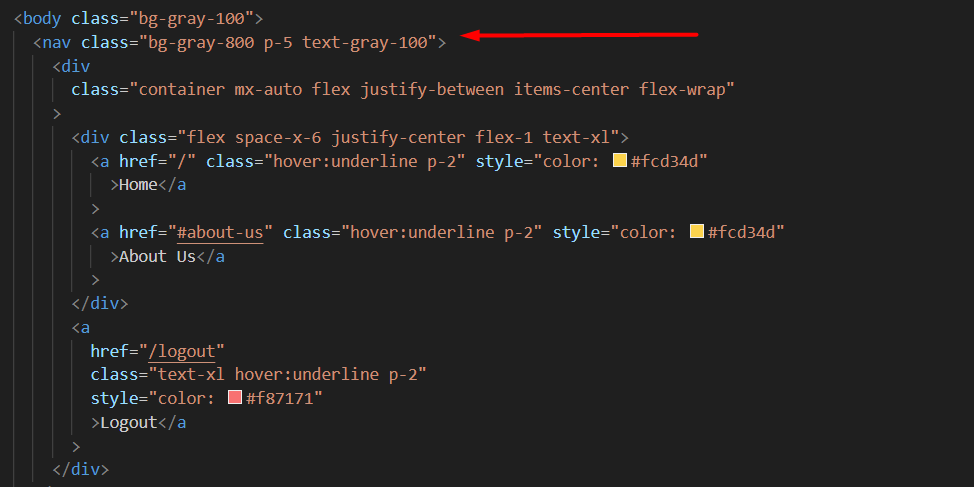
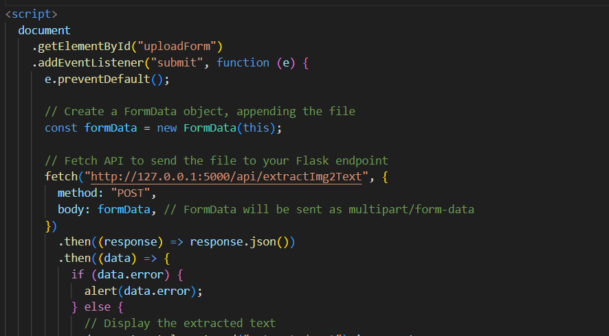
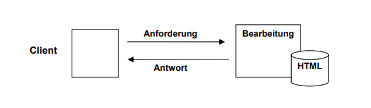

## Inhaltsverzeichnis

- [Application](#application)
- [Tech Stack](#tech-stack)
- [Modules](#modules)

## Application

## Tech Stack

### Frontend

**Tailwind CSS**: Ein Utility-first CSS-Framework, das uns ermöglichte, das Design unserer Webanwendung schnell und effizient zu gestalten, ohne dabei von Grund auf eigene Styles schreiben zu müssen. Die Design wurden direkt in die HTML-Klassen definiert.

In der Praxis:



**HTML:** Darauf brauch man gar nicht viel eingehen. Es ist die Standard-Markdownsprache für die Erstellung von Webseiten. Wir verwendeten HTML, um die Struktur der Benutzeroberfläche von ProConverter zu definieren. Dies umfasste die Definition von Textinhalten, Formularen für die Dateikonvertierung und anderen interaktiven Elementen, die für die Nutzung des Tools wichtig sind.

**JavaScript:** Eine Programmiersprache, die im Browser ausgeführt wird und es uns ermöglichte, dynamische Interaktionen auf der Client-Seite zu implementieren. Mit JavaScript fügten wir interaktive Funktionen hinzu, wie z.B. das sofortige Feedback bei der Auswahl von Dateien zur Konvertierung, dynamische Updates der Benutzeroberfläche ohne Seite neu zu laden und die Validierung von Benutzereingaben oder das fetchen eines API-Endpunktes auf der Client-Seite.

Beispiel:



### Backend

**Flask:** Ein Mikro-Webframework für Python, das für die Entwicklung des Backends von ProConverter verwendet wurde. Flask bot uns die Flexibilität, RESTful APIs zu erstellen, durch die das Frontend mit dem Backend kommunizieren konnte. Dies ermöglichte die Verarbeitung von Dateikonvertierungsanfragen, Benutzerauthentifizierung und die Verwaltung von Nutzerdaten.

**Python:** Eine Programmiersprache, die im Backend für die allgemeine Geschäftslogik von unserer App eingesetzt wurde. Python ermöglichte es uns, Methoden für die Dateikonvertierung zu implementieren, die Interaktion mit der Datenbank zu verwalten und die Integration mit verschiedenen Bibliotheken und Frameworks wie Flask und SQL Alchemy zu erleichtern.

**SQLAlchemy:** Eine SQL-Toolkit- und Object-Relational Mapping (ORM) Bibliothek für Python, die die Datenbankinteraktionen vereinfachte. Mit SQLAlchemy konnten wir Modelle für unsere Datenbanktabellen definieren und Datenbankabfragen ausführen, ohne rohes SQL schreiben zu müssen. Dies erleichterte die Speicherung und Abfrage von Nutzerdaten sowie die Verwaltung von Konvertierungsaufträgen und -ergebnissen.

### Stack Extension

Zu unserem TechStack haben wir als Erweiterung **PyTesseract** hinzugefügt, ein leistungsstarkes OCR (Optical Character Recognition) Tool, das in Python implementiert ist. PyTesseract ermöglichte es uns, Text aus Bildern und PDF-Dateien zu extrahieren, was eine bedeutende Erweiterung unserer Applikation darstellt.

PyTesseract: OCR-Tool Integration
PyTesseract: Ein OCR-Tool, das auf der Tesseract-Engine basiert, einer der genauesten Open-Source-OCR-Engines, die verfügbar sind. Mit PyTesseract konnten wir die Funktionalität von ProConverter erweitern, indem wir Nutzern ermöglichten, Text aus Bildern (wie PNG oder JPG) und gescannten PDF-Dokumenten zu extrahieren. Diese Funktion ist besonders wertvoll für Nutzer, die digitale Kopien von gedruckten Dokumenten verarbeiten oder Informationen aus Bildern in bearbeitbare Textformate umwandeln möchten.

Die Integration von PyTesseract in unseren Backend-TechStack nutzte die Flexibilität von Python, um Bildverarbeitungs- und Texterkennungsaufgaben effizient zu bewältigen.

Durch die Kombination von PyTesseract mit Flask, SQLAlchemy und unserem restlichen Backend- und Frontend-TechStack konnten wir eine umfassende Lösung für Datei- und Textkonvertierungsbedürfnisse anbieten

## Modules

(Info: Alle Code Beispiele unten sind aus unserer [app.py](https://github.com/5mbl/ocr-backend/blob/master/app.py) entnommen)

Für unser Projekt haben wir eine Reihe von Modulen (Bibliotheken) verwendet, die entscheidend für die Funktionalität, Effizienz und die Architektur der Applikation sind. Jedes dieser Module spielt eine spezifische Rolle im Gesamtzusammenhang der Anwendung.

### pdf2image

pdf2image ist ein Python-Modul, das PDF-Dokumente in Bilder konvertiert. Dies ist wichtig für das Projekt, da es die Grundlage für die Textextraktion mit OCR aus PDF-Dateien bildet, indem es die Seiten eines PDFs in Bilder umwandelt, die dann z.B. mit PyTesseract verarbeitet werden können. Es ermöglicht eine die Bearbeitung von PDF-Inhalten, die nicht direkt textlich extrahiert werden können.

### poppler

poppler ist auch eine unserer Backend-Bibliotheken, die von pdf2image benötigt wird, um PDFs in Bilder umzuwandeln. Es ist eine freie Softwarebibliothek, die für die Verarbeitung von PDF-Inhalten verwendet wird. Die Einbindung von poppler in unser Projekt ermöglicht es pdf2image, effizient und zuverlässig zu funktionieren, was für die Umwandlung von PDF-Dokumenten in ein Format entscheidend ist

### zipfile

Das zipfile-Modul ermöglicht es, mit ZIP-Archiven zu arbeiten; es kann Archive lesen und schreiben. In unserer App verwenden wir zipfile, um mehrere Dateien oder Konvertierungsergebnisse in einem einzigen ZIP-Archiv zu bündeln, was den Download und die Handhabung vereinfacht. Dies ist besonders nützlich, wenn Nutzer mehrere Dateien gleichzeitig konvertieren, da es den Prozess effizienter macht.

```python
 # Prepare a ZIP archive to store PNG images
        zip_bytes_io = io.BytesIO()
        with zipfile.ZipFile(zip_bytes_io, 'w', zipfile.ZIP_DEFLATED) as zip_file:
            for i, image in enumerate(images):
                # Save each image to a BytesIO object
                img_byte_arr = io.BytesIO()
                image.save(img_byte_arr, format='PNG')

                # Add image to zip file
                img_byte_arr.seek(0)
                zip_file.writestr(f'image_{i+1}.png', img_byte_arr.getvalue())

```

Dieser Code Abschnitt erstellt in unserem Projekt ein ZIP-Archiv, das PNG-Bilder enthält. Zunächst wird ein BytesIO-Puffer erstellt, der als Container für das ZIP-Archiv dient. Dann wird eine ZipFile-Instanz erstellt, die auf diesem Puffer basiert. Diese Instanz öffnet die ZIP-Datei im Schreibmodus und verwendet die ZIP_DEFLATED-Komprimierungsmethode, um die Dateien im Archiv zu komprimieren.

Anschließend durchläuft der Code eine Schleife, die jedes Bild in der Liste images verarbeitet. Für jedes Bild wird ein neuer BytesIO-Puffer erstellt, um das Bild temporär zu speichern. Das Bild wird im PNG-Format in den BytesIO-Puffer geschrieben und dann dem ZIP-Archiv hinzugefügt.

Auf diese Weise werden alle Bilder aus der Liste images nacheinander in das ZIP-Archiv geschrieben.

### Pillow

Pillow, das Python Imaging Library (PIL) Fork, ist eine Bibliothek zur Bildverarbeitung. Wir nutzen Pillow für eine verschiedene Aufgaben, wie zum Beispiel Bildoptimierung (bzw. Vorbereitung damit das Bild zugänglich gemacht wird für unsere API) und -manipulation, um die Bilder für die OCR-Verarbeitung vorzubereiten. Pillow ist wichtig für die Handhabung und Anpassung von Bildern, was direkt die Effizienz und Genauigkeit der Textextraktion beeinflusst.

Beispiel aus unserem Code:

```python
from PIL import Image

img = Image.open(io.BytesIO(png_bytes))

```

Um ein Bild aus einem BytesIO-Puffer zu öffnen verwenden wir PIL (Python Imaging Library). Zuerst wird die Image-Klasse aus dem PIL-Modul importiert, die für die Arbeit mit Bildern in Python zuständig ist.

Anschließend wird das Bild aus dem BytesIO-Puffer geöffnet und in das img-Objekt geladen. Der BytesIO-Puffer namens png_bytes enthält die Rohdaten des Bildes. Nach der Ausführung des Codes enthält die Variable img eine Referenz auf das geöffnete Bild, das weiterverarbeitet oder angezeigt werden kann.

Natürlich haben wir auch andere Klassen auf PIL verwenden, nämlich **ImageDraw** und **ImageFont** um Bilder zu manipulieren.

```python
def text_file_to_png(text_content, font_size=24, image_size=(600, 400)):
    """Converts text content to a PNG image."""
    img = Image.new('RGB', image_size, color='white')
    draw = ImageDraw.Draw(img)
    # Use a truetype font available on your system or specify the path to a ttf file
    font = ImageFont.truetype("arial.ttf", font_size)
    # Optionally, add some padding or calculate text positioning to center
    draw.text((10, 10), text_content, fill='black', font=font)
```

**ImageFont:** Diese Klasse ermöglicht den Zugriff auf Schriftarten für die Verwendung beim Zeichnen von Text auf Bildern. Sie bietet Funktionen zum Laden von TrueType-Schriftarten (truetype) (in diesem Fall haben wir arial.ttf verwendet), die dann für das Zeichnen von Text mit einer bestimmten Schriftart verwendet werden können.

**ImageDraw:** Diese Klasse stellt Funktionen zum Zeichnen von Formen, Linien, Text und anderen Grafikelementen auf Bildern bereit. Es ermöglicht es uns, ein Zeichenobjekt zu erstellen, das an ein Bild gebunden ist, und bietet Methoden zum Zeichnen verschiedener Grafikelemente auf diesem Bild. Das Zeichenobjekt kann verwendet werden, um Bilder dynamisch zu erstellen, welches wir für die TXT to PNG Konvertierung in unserem Tool brauchen.

### tempfile

Mit dem tempfile-Modul können temporäre Dateien und Verzeichnisse erstellt werden. In ProConverter wird es genutzt, um temporäre Speicherorte für die Verarbeitung von Dateien bereitzustellen.

Beispiel aus unserem Code:

```python
# Temporarily save PDF to disk to convert it

with tempfile.NamedTemporaryFile(delete=False) as temp_pdf:
    pdf_file.save(temp_pdf)
    temp_pdf_path = temp_pdf.name
```

Dieser Teil verwendet das tempfile-Modul, um vorübergehend eine PDF-Datei im Ordner (lokal) zu speichern, bevor sie konvertiert wird. Das tempfile-Modul stellt Funktionen bereit, um temporäre Dateien und Verzeichnisse zu erstellen und zu verwalten, welche wir benötigen damit unser Tool Zugriff auf das Bild hat, das konvertiert werden soll.

In diesem Fall wird NamedTemporaryFile verwendet, um eine benannte temporäre Datei zu erstellen, die nicht automatisch gelöscht wird, wenn sie geschlossen wird. Die PDF-Datei wird dann in diese temporäre Datei gespeichert, und der Dateipfad der temporären Datei wird für weitere Verarbeitungsschritte gespeichert. Damit wird eine temporäre Speicherung auf der Festplatte ermöglicht, ohne dass dauerhafte Dateien angelegt werden müssen.

## Aufbau der App

### Clientseite

Die Clientseite umfasst Aspekte der Applikation, die direkt im Webbrowser des Benutzers ausgeführt werden. Hier wird die Benutzeroberfläche dargestellt, durch die Benutzer mit ProConverter interagieren können. Die Entwicklung des Frontends für ProConverter verwendet Technologien wie HTML, Tailwind CSS und JavaScript. HTML bildet das Grundgerüst der Seite, definiert die Struktur und den Inhalt. Tailwind CSS wird für das Design und die responsive Gestaltung verwendet, um sicherzustellen, dass die Applikation auf verschiedenen Geräten und Bildschirmgrößen gut aussieht und funktioniert. JavaScript ermöglicht dynamische Interaktionen auf der Clientseite, wie das Hochladen von Dateien, das Auslösen von Konvertierungen und das Empfangen von Ergebnissen, ohne die Seite neu laden zu müssen.



Bild-Quelle: [cs.fau.de](https://www4.cs.fau.de/Lehre/SS04/PS_KVBK/talks/Handout-Webanwendung-2.pdf)

### Serverseite

Die Serverseite beinhaltet die Logik und Datenverarbeitung, die auf dem Server stattfindet. In ProConverter wird das Backend mit Flask, einem Python-Webframework, und weiteren Python-Bibliotheken wie PyTesseract für OCR-Aufgaben, pdf2image für die Konvertierung von PDF-Dokumenten in Bilder und SQLAlchemy für die Datenbankinteraktion entwickelt. Das Backend ist auch verantwortlich für die Verarbeitung von Anfragen, die vom Frontend kommen, einschließlich der Ausführung von Dateikonvertierungen und der Verwaltung von Benutzerdaten. Es kommuniziert mit dem Frontend über dem Aufrufen der Methoden, um Daten auszutauschen und Konvertierungsergebnisse zurückzusenden.

### User-Auth

Die Benutzerauthentifizierung (User-Authentication) mit Benutzername und Passwort umfasst eine Reihe von Schritten, um die Identität zu überprüfen und Benutzern sicher Zugriff zu gewähren. Zuerst gibt der Benutzer seinen Benutzernamen und sein Passwort über die „register page“ auf der Website ein. Der Server validiert die Eingabe, um sicherzustellen, dass sie den Anforderungen entspricht. Wenn die Eingabe gültig ist, speichert der Server die Benutzerinformationen sicher in der Datenbank und hashed das Passwort.

Um auf das Konto zuzugreifen, geben die Benutzer ihren Benutzernamen und ihr Passwort in das Anmeldeformular in der „login page“ ein. Die Front-End sendet die Anmeldeanfrage an den Server, der die bereitgestellten Anmeldeinformationen überprüft, indem er überprüft, ob der Benutzername in der Datenbank existiert und ob der Passworthash mit dem gespeicherten Hash übereinstimmt.

Wenn die Anmeldeinformationen korrekt sind, richtet der Server eine Sitzung für den Benutzer ein. Nach erfolgreichem Login generiert der Server eine eindeutige Sitzungs-ID für den Benutzer.

Zusammenfassend umfasst die Benutzerauthentifizierung mit Benutzername und Passwort, dass Benutzer ihre Anmeldeinformationen registrieren, der Server diese während des Anmeldevorgangs überprüft, und die Einrichtung einer Sitzung für authentifizierte Benutzer, die einen sicheren und personalisierten Zugriff auf die Webanwendung ermöglicht.

### OCR

OCR steht ,,für Optical Character Recognition” und wird in unserem Projekt ebenfalls genutzt.
Diese Technologie ermöglicht es aufgenommene Bilder, welche Texte und Zeichen enthalten,
zu scannen und anschließend zu bearbeiten. In unserer Anwendung bieten wir einen
Converter, der darauf zurückgreift. OCR selbst funktioniert mit Mustererkennung, bei dem es
im Hintergrund einen Datenbankabgleich durchführt, um Zusammenhänge zwischen Worten
und Sätzen aufzufinden.
Der Scan wird in 5 unterschiedlichen Phasen unterteilt:
Im ersten Schritt wird das Bild so gut es geht für den Scan formatiert (schwarz/weiß
Kontraste) und Absätze sowie Überschriften kenntlich gemacht.
Daraufhin schaut das System nach grafischen Elementen noch bevor Buchstaben
entschlüsselt werden, in dem es das Dokument Zeile für Zeile durchgeht.
Anschließend werden Schriftzeichen interpretiert, während das System durch die Datenbank
läuft, damit man am Ende weiß, um welche Buchstaben und Zeichen es sich handelt.
Im nächsten Schritt wird meistens eine Nachbearbeitung durchgeführt (ICR), was eine Art
Autokorrektur vom Text bildet.
Zuletzt wird der Text in ein gewünschtes Dateiformat umgewandelt und kann nun vom
Nutzer verwendet werden.
