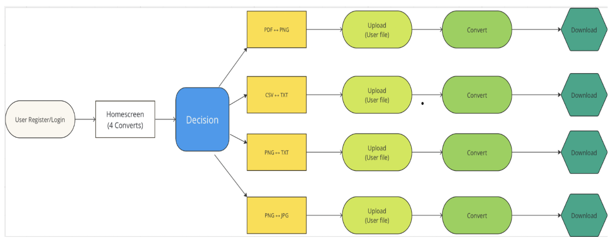
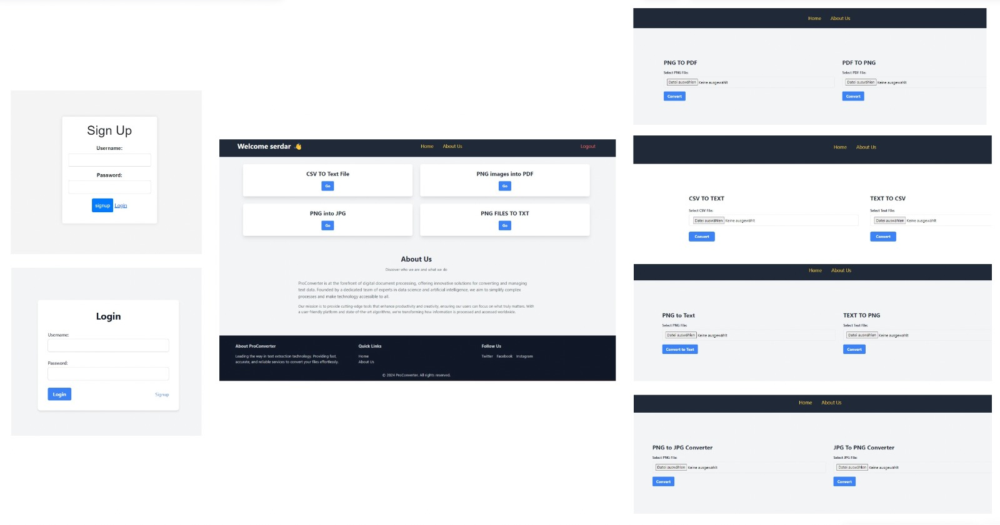

## Inhaltsverzeichnis

- [Automatischer Dateidownload nach Konvertierungsende](#automatischer-dateidownload-nach-konvertierungsende)
- [Benutzerauthentifizierung](#benutzerauthentifizierung)
- [Benutzeroberfläche](#benutzeroberfläche)
- [Screen Flow](#screen-flow)

## Automatischer Dateidownload nach Konvertierungsende:

**Problemstellung:**

Eine nahtlose Benutzererfahrung bei ProConvert, einer Plattform zur Dateikonvertierung, zu gewährleisten, erfordert eine Entscheidung, ob konvertierte Dateien automatisch oder manuell heruntergeladen werden sollten.

**Entscheidung:**
Automatischer Download nach Konvertierungsende wird gewählt, um:

- Die Benutzererfahrung durch Eliminierung zusätzlicher Schritte zu verbessern.
- Die Effizienz durch Zeitersparnis für den Benutzer zu steigern.
- Das Fehlerpotenzial durch Minimierung der Benutzerintervention zu reduzieren.
- Konsistenz über die App hinweg zu wahren.

## Benutzerauthentifizierung

**Problemstellung:**

Es muss entschieden werden, ob eine Benutzerauthentifizierung notwendig ist, um Zugang zu den ProConvert-Diensten zu erhalten, um Sicherheit und Personalisierung zu gewährleisten.

**Entscheidung:**
Benutzerauthentifizierung ist erforderlich, um:

- Die Sicherheit durch Zulassung nur autorisierter Zugriffe zu erhöhen.
- Personalisierungsmöglichkeiten für maßgeschneiderte Benutzererlebnisse zu bieten.
- Benutzerdaten sicher und verantwortungsvoll zu verwalten.
- Benutzerverantwortlichkeit zu fördern.

## Benutzeroberfläche

**Problemstellung:**
Die Herausforderung bei der Entwicklung von ProConvert liegt in der Schaffung einer intuitiven Benutzeroberfläche, die Konvertierungsoptionen zentralisiert darstellt und dabei Einfachheit sowie Übersichtlichkeit garantiert.
Entscheidungsfindung:
Eine zentrale Darstellung der Konvertierungsoptionen wird bevorzugt, um:

- Die Benutzerführung zu optimieren und den gesamten Konvertierungsprozess zu straffen.
- Entscheidungsprozesse durch klare und direkt sichtbare Optionen zu beschleunigen.
- Eine konsistente Benutzererfahrung über die gesamte Plattform hinweg zu bieten.
- Die Plattform zukunftssicher zu machen, indem Flexibilität für Erweiterungen und Updates ermöglicht wird.

## Screen Flow

